## About

I'm **Jakob Werner** (`jakeefr` / [`@jxkedevs`](https://x.com/jxkedevs)), a freelance web and AI
developer and the founder of **[Werner's Works](https://wernersworks.dev)**, based in the
Oklahoma City area. I hold a B.S. in Cyber Security & Forensics and build production web
applications, autonomous AI agent systems, and native iOS apps for clients end to end.

## What I Do

Full service breakdown at [wernersworks.dev/services](https://wernersworks.dev/services).

| Service | Description |
| --- | --- |
| **Custom Websites** | Production-level sites in React / Next.js / Tailwind — responsive, SEO-ready, fast, clean handed-off code |
| **UI/UX Systems** | Design systems and component libraries — accessible, consistent design language, prototypes and motion |
| **Agents as a Company** | Autonomous multi-agent AI systems (marketing, content, dev, research, ops) with human-in-the-loop approval |
| **Performance & Optimization** | Code splitting, asset optimization, Core Web Vitals tuning |
| **iOS App Development** | Native Swift / React Native, concept to App Store |
| **AI Automation & Integrations** | Automated workflows, SMS/email lead follow-up, CRM and third-party integrations |
| **Security & QA Audits** | Web app pentests, bug-bounty-style vuln hunting, red-team assessments, QA/accessibility/performance audits |

## Tech Stack

---

**jakeefr** · [`@jxkedevs`](https://x.com/jxkedevs) · [wernersworks.dev](https://wernersworks.dev)

